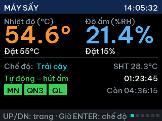
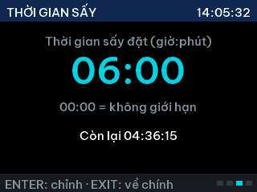
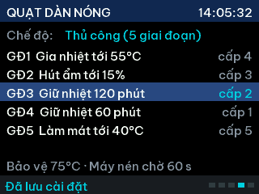
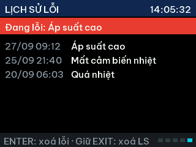
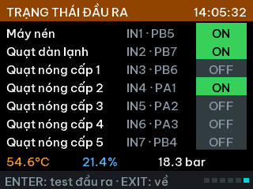
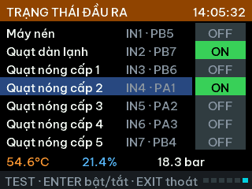
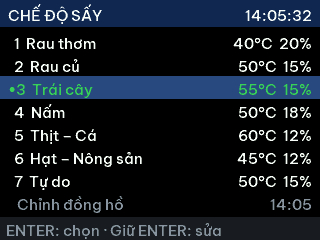
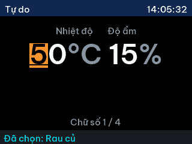
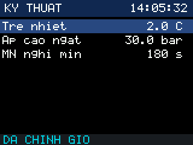

# Giao diện TFT & cách dùng nút

Ảnh dưới đây chụp từ bộ mô phỏng trên PC (`sh tools/host_check/check.sh`), chạy nguyên code `App/ui`.

## Font tiếng Việt

Giao diện dùng font **Be Vietnam Pro** (SIL Open Font License 1.1) chuyển thành bitmap anti-alias 2 bit/pixel:

| Font | Dùng cho | Ký tự | Flash |
|------|----------|-------|-------|
| `font_vn16` (15 px, cao dòng 23 px) | mọi chữ | ASCII + 134 chữ cái có dấu + `° · • – …` | ~9.5 KB |
| `font_num` (46 px, cao 35 px) | số lớn | `0-9 . - : % ° C` | ~3.8 KB |

* Chuỗi viết thẳng tiếng Việt trong code (file lưu **UTF-8**), ví dụ `"Nhiệt độ"`. Ký tự thiếu trong font hiện `?`.
* Đổi cỡ chữ / thêm ký tự: sửa bảng `FONTS` trong `tools/fontgen/fontgen.py` rồi chạy
  `python tools/fontgen/fontgen.py` (cần `pip install pillow`) → sinh lại `App/drivers/ili9341/fonts_vn.c`.
* Keil ARMCC 5: cần option `--no_multibyte_chars` (C/C++ → Misc Controls) – `tools/keil_setup.py` tự thêm.
* Toàn bộ firmware hiện ~52 KB / 62 KB Flash.

## 6 trang chính – chuyển bằng UP / DOWN

| Trang | Nội dung | Phím riêng |
|-------|----------|------------|
| 1 Chính | Nhiệt độ, độ ẩm (số lớn) + điểm đặt, chế độ sấy, giai đoạn đang chạy, thời gian, relay (MN, QN + cấp, QL) | Giữ EXIT 3 s: menu kỹ thuật |
| 2 Chạy / Dừng | Trạng thái (Tự động/Thủ công), giai đoạn, đã sấy, còn lại, máy nén | ENTER: chạy / dừng |
| 3 Thời gian sấy | HH:MM (00:00 = không giới hạn). **Chỉ dùng cho chế độ Tự động**, Thủ công hiện "không áp dụng" | ENTER: chỉnh từng chữ số |
| 4 Quạt dàn nóng | Chế độ Tự động / Thủ công, bảng 5 giai đoạn + cấp quạt, nhiệt độ bảo vệ, thời gian chờ máy nén | ENTER: danh sách cài đặt |
| 5 Lịch sử lỗi | Lỗi đang có + 6 lỗi gần nhất (ngày giờ, tên lỗi) | ENTER: xoá lỗi đang có · Giữ EXIT 3 s: xoá lịch sử |
| 6 Trạng thái đầu ra | 7 relay (máy nén, quạt dàn lạnh, quạt nóng cấp 1–5) kèm chân IN/GPIO, ô **ON** xanh / **OFF** xám. Dòng dưới: **nhiệt độ · độ ẩm · áp suất** hiện tại. Chân ra: ON = 0 V, OFF = 3.3 V (module relay kích mức thấp). Giả lập với *Relay thật = Tắt*: ô vàng **ON\*** = bộ điều khiển yêu cầu bật nhưng relay không đóng | **ENTER: test đầu ra** (xem dưới) |

Ở mọi trang: **giữ ENTER 3 s → menu chế độ sấy**, EXIT → về trang chính.
Header luôn hiện đồng hồ HH:MM:SS; footer hiện gợi ý phím, thông báo và số trang (6 ô vuông).

 
 
 

### Test đầu ra (trang 6)

Bật/tắt tay từng relay để kiểm tra dây, đo điện áp chân ra. Chỉ vào được khi máy **không chạy** (Đang dừng hoặc đang Lỗi –
nên dùng được cả khi chưa gắn cảm biến).

| Phím | Tác dụng |
|------|----------|
| ENTER | vào test (dòng đang chọn tô xanh, footer hiện *TEST*) |
| UP / DOWN | chọn đầu ra |
| ENTER | bật / tắt đầu ra đang chọn |
| EXIT | thoát test, **tắt hết** |

* Quạt dàn nóng vẫn qua khoá liên động: bật cấp mới thì cấp cũ tự tắt, nghỉ 1 s (ô **ON\*** vàng trong lúc nghỉ).
* Máy nén vẫn giữ thời gian chờ bật lại (*Máy nén chờ … s*), kể cả ngay sau khi cấp điện.
* Luôn đóng relay thật (kể cả khi đang giả lập với *Relay thật = Tắt*).
* Đang test thì không chạy sấy được; 10 phút không bấm phím → tự thoát và tắt hết.



## Điều khiển quạt dàn nóng & máy nén

**Tự động** – quạt dàn nóng chạy cấp *Tự động: cấp quạt* (mặc định 3):
1. Quạt chạy trước *GĐ1: quạt chạy trước* giây (mặc định 60 s) rồi bật máy nén.
2. Máy nén chạy liên tục tới khi độ ẩm ≤ độ ẩm đặt → dừng máy nén.
3. Sau đó máy nén bật/tắt giữ nhiệt độ đặt, bỏ qua độ ẩm, tới hết *thời gian sấy* (trang 3).
4. Hết giờ: tắt máy nén, quạt chạy làm mát tới *GĐ5: nhiệt độ dừng* thì kết thúc. Thời gian sấy 00:00 = chạy tới khi bấm dừng.

**Thủ công** – 5 giai đoạn, mỗi giai đoạn chọn cấp quạt riêng; thời gian sấy trang 3 không áp dụng:

| GĐ | Máy nén | Chuyển sang GĐ sau khi |
|----|---------|------------------------|
| 1 | quạt chạy trước 60 s, rồi máy nén chạy liên tục | nhiệt độ ≥ nhiệt độ đặt |
| 2 | giữ nhiệt độ đặt | độ ẩm ≤ độ ẩm đặt |
| 3 | giữ nhiệt độ đặt | hết *GĐ3: thời gian* (phút) |
| 4 | giữ nhiệt độ đặt | hết *GĐ4: thời gian* (phút) |
| 5 | **tắt** | nhiệt độ ≤ *GĐ5: nhiệt độ dừng* → kết thúc chu trình |

Chung cho cả hai chế độ:
* **Máy nén chờ bật lại** (mặc định 60 s, chỉnh ở trang 4): sau mỗi lần dừng phải chờ đủ mới bật lại.
* **Nhiệt độ bảo vệ** (mặc định 75 °C, chỉnh ở trang 4): vượt → báo lỗi *Quá nhiệt*, **tắt máy nén**,
  **quạt dàn lạnh + quạt dàn nóng cấp 5 chạy liên tục** tới khi nhiệt độ ≤ *Quá nhiệt: nguội tới* (mặc định **30 °C**,
  chỉnh ở trang 4, luôn ≤ nhiệt độ bảo vệ − 5) → tự hết lỗi, máy dừng (cần bấm chạy lại). Chưa nguội thì ENTER ở trang 5
  không xoá được lỗi (báo *Chờ nguội về 30°C*), test đầu ra cũng bị khoá. Mất cảm biến nhiệt trong lúc làm mát → quạt vẫn chạy,
  xoá lỗi bằng tay. ⚠ Nếu trời nóng hơn 30 °C buồng sẽ không nguội tới 30 °C → quạt chạy mãi: tăng giá trị này (vd 35 °C).
* Quạt dàn lạnh chạy suốt chu trình. Quạt dàn nóng 5 cấp: chỉ 1 relay đóng, đổi cấp nghỉ 1 s.
* Mất cảm biến ẩm: Tự động chuyển sang giữ nhiệt; Thủ công bỏ qua GĐ2 (có cảnh báo).
* Đổi chế độ khi máy đang chạy: áp dụng từ lần chạy sau.

## Tự tắt màn hình

* **Tắt màn hình sau** (phút, mặc định **5**, chỉnh ở trang 4, **0 = luôn sáng**): không bấm nút nào trong khoảng này
  → màn hình tô đen và tắt đèn nền. Máy vẫn chạy bình thường.
* Bấm **nút bất kỳ** → sáng lại đúng trang đang xem. Lần bấm đánh thức **không** thực hiện chức năng của nút
  (kể cả khi giữ lâu) – bấm lại lần nữa mới tác dụng.
* Có **lỗi mới** → màn hình tự sáng lại để người vận hành thấy.
* Đèn nền chỉ tắt hẳn khi chân **LED** của module TFT nối **PA11** (xem PINOUT.md); chưa nối thì màn hình chỉ đen.

## Menu chế độ sấy (giữ ENTER 3 s)

6 chế độ đặt sẵn + *Tự do* + *Chỉnh đồng hồ*. Dấu `*` là chế độ đang dùng.

* UP / DOWN: chọn dòng · EXIT: thoát
* ENTER trên chế độ đặt sẵn: áp dụng ngay, lưu Flash
* **Giữ ENTER 3 s** trên chế độ đặt sẵn: sửa nhiệt độ / độ ẩm của chế độ đó
* ENTER trên *Tự do*: nhập nhiệt độ, độ ẩm rồi áp dụng
* ENTER trên *Chỉnh đồng hồ*: nhập ngày / tháng / năm giờ : phút



## Nhập số từng chữ số

Chữ số đang chỉnh có nền cam + gạch chân. UP / DOWN: tăng / giảm (0–9 vòng tròn, giữ để lặp).
ENTER: sang chữ số bên phải; ENTER ở chữ số cuối: **lưu**. EXIT: huỷ.
Nhiệt độ được giới hạn 30–75 °C, độ ẩm 5–80 %RH (ngoài khoảng sẽ bị kẹp và báo *Đã giới hạn*).

 

## Menu kỹ thuật (giữ EXIT 3 s ở trang chính)

Trễ nhiệt/ẩm, quá nhiệt, áp cao/thấp, thời gian bảo vệ máy nén, quạt, bù sai số cảm biến.
ENTER: sửa · UP/DOWN: đổi theo bước · ENTER: xác nhận · EXIT: lưu & thoát.



## Đổi chế độ đặt sẵn

Tên và giá trị mặc định nằm trong `App/services/presets.c`. Giá trị người dùng sửa trên máy được lưu
trong Flash (settings), không mất khi mất điện.

## Đồng hồ

RTC nội STM32 + thạch anh 32.768 kHz có sẵn trên Blue Pill. Cắm pin CR2032 vào chân VB để giữ giờ khi
mất điện. Chưa chỉnh giờ thì đồng hồ hiện `--:--:--` và lịch sử lỗi ghi `--/-- --:--`.
Khi chỉnh giờ, ngày nhập dạng `ngày-tháng-năm` (dòng trên) và `giờ:phút` (dòng dưới).

## Chạy giả lập (khi chưa có cảm biến)

Vào: trang 2 **Chạy / Dừng** → **giữ EXIT 3 s** → danh sách *GIẢ LẬP (không lưu)*. Header chuyển **màu cam**,
trang chính hiện dòng `GIẢ LẬP · Mô hình x60`. Giả lập chỉ nằm trong RAM: tắt nguồn / reset là tắt.

Chưa gắn cảm biến nhiệt: lúc khởi động máy báo lỗi *Mất cảm biến nhiệt* và khoá chạy. **Bật giả lập sẽ tự xoá lỗi này**
(giá trị giả lập luôn hợp lệ) → ENTER ở trang 2 là chạy được. Chưa gắn cảm biến áp suất: đặt *Bảo vệ áp suất = Tắt*
trong menu kỹ thuật (trang 1, giữ EXIT 3 s) – cài đặt này lưu Flash.

| Mục | Giá trị | Ý nghĩa |
|-----|---------|---------|
| Giả lập | Tắt / **Mô hình** / **Chỉnh tay** | Mô hình: nhiệt độ, độ ẩm, áp suất tự thay đổi theo máy nén + quạt. Chỉnh tay: bạn tự đặt nhiệt độ, độ ẩm |
| Tua nhanh | x1 / x10 / x60 / x300 | Đồng hồ bộ điều khiển chạy nhanh hơn (GĐ3 120 phút ở x300 còn 24 giây). Quạt 5 cấp vẫn nghỉ 1 s thật khi đổi cấp |
| Nhiệt độ, Độ ẩm | °C, %RH | Chỉnh tay: giá trị đưa vào bộ điều khiển. Mô hình: đặt lại điểm xuất phát |
| Tạo lỗi | Không / Mất CB nhiệt / Mất CB ẩm / Áp suất cao | Thử các bảo vệ và lịch sử lỗi |
| Relay thật | Tắt / **Bật** | Mặc định chân ra + relay chạy theo bộ điều khiển khi giả lập → đo được điện áp thực tế. **Tháo dây máy nén / quạt (hoặc nguồn tải) nếu không muốn thiết bị chạy thật.** Tắt = chỉ hiện trên màn hình. |

Cách thử từng giai đoạn:
1. Trang 4 chọn chế độ (Tự động / Thủ công), đặt cấp quạt, thời gian GĐ3/GĐ4.
2. Giả lập = **Mô hình**, Tua nhanh = **x60** → EXIT → ENTER để chạy. Theo dõi trang 1, 2, 4 (GĐ đang chạy được tô).
3. Muốn ép chuyển giai đoạn: Giả lập = **Chỉnh tay**, đặt nhiệt độ ≥ nhiệt độ đặt (qua GĐ1), độ ẩm ≤ độ ẩm đặt (qua GĐ2),
   nhiệt độ ≤ nhiệt độ dừng (kết thúc GĐ5).
4. Tạo lỗi *Áp suất cao* hoặc đặt nhiệt độ > nhiệt độ bảo vệ → máy dừng, trang 5 ghi lỗi. Quá nhiệt: Chỉnh tay hạ nhiệt độ
   xuống ≤ 30 °C (hoặc để Mô hình tự nguội, môi trường 28 °C) → hết lỗi.

Trên PC, bước 5 của `sh tools/host_check/check.sh` chạy trọn 1 chu trình với cùng mô hình và in mốc từng giai đoạn:

```
TU DONG:   1 phút quạt chạy trước → 42 phút hút ẩm (T lên 61 °C) → giữ 55 °C tới 240 phút → làm mát → 256 phút xong
THU CONG:  GĐ1 31 phút → GĐ2 18 phút → GĐ3 120 phút → GĐ4 60 phút → GĐ5 11 phút → 240 phút xong
```
Mô hình chỉ gần đúng để kiểm tra trình tự, không thay được số đo thật.
