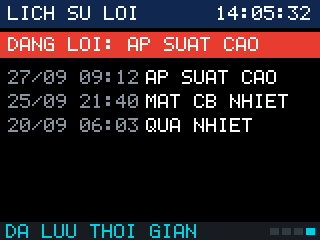

# Giao diện TFT & cách dùng nút

Ảnh dưới đây chụp từ bộ mô phỏng trên PC (`sh tools/host_check/check.sh`), chạy nguyên code `App/ui`.
Font 5x7 chỉ có chữ không dấu.

## 4 trang chính – chuyển bằng UP / DOWN

| Trang | Nội dung | Phím riêng |
|-------|----------|------------|
| 1 Chính | Nhiệt độ, độ ẩm thực tế (số lớn) + điểm đặt, chế độ đang dùng, trạng thái, thời gian đã sấy / còn lại, relay | Giữ EXIT 3 s: menu kỹ thuật |
| 2 Chạy / Dừng | Trạng thái, thời gian sấy, máy nén | ENTER: chạy / dừng |
| 3 Thời gian sấy | HH:MM (00:00 = không giới hạn), thời gian còn lại | ENTER: chỉnh từng chữ số |
| 4 Lịch sử lỗi | Lỗi đang có + 6 lỗi gần nhất (ngày giờ, tên lỗi) | ENTER: xoá lỗi đang có · Giữ EXIT 3 s: xoá lịch sử |

Ở mọi trang: **giữ ENTER 3 s → menu chế độ sấy**, EXIT → về trang chính.
Header luôn hiện đồng hồ HH:MM:SS; footer hiện gợi ý phím, thông báo và số trang (4 ô vuông).

 
 

## Menu chế độ sấy (giữ ENTER 3 s)

6 chế độ đặt sẵn + *Tu do* + *Chinh dong ho*. Dấu `*` là chế độ đang dùng.

* UP / DOWN: chọn dòng · EXIT: thoát
* ENTER trên chế độ đặt sẵn: áp dụng ngay, lưu Flash
* **Giữ ENTER 3 s** trên chế độ đặt sẵn: sửa nhiệt độ / độ ẩm của chế độ đó
* ENTER trên *Tu do*: nhập nhiệt độ, độ ẩm rồi áp dụng
* ENTER trên *Chinh dong ho*: nhập ngày / tháng / năm giờ : phút

## Nhập số từng chữ số

Chữ số đang chỉnh có nền cam + gạch chân. UP / DOWN: tăng / giảm (0–9 vòng tròn, giữ để lặp).
ENTER: sang chữ số bên phải; ENTER ở chữ số cuối: **lưu**. EXIT: huỷ.
Nhiệt độ được giới hạn 30–75 °C, độ ẩm 5–80 %RH (ngoài khoảng sẽ bị kẹp và báo *DA GIOI HAN*).

 

## Menu kỹ thuật (giữ EXIT 3 s ở trang chính)

Trễ nhiệt/ẩm, quá nhiệt, áp cao/thấp, thời gian bảo vệ máy nén, quạt, bù sai số cảm biến.
ENTER: sửa · UP/DOWN: đổi theo bước · ENTER: xác nhận · EXIT: lưu & thoát.

## Đổi chế độ đặt sẵn

Tên và giá trị mặc định nằm trong `App/services/presets.c`. Giá trị người dùng sửa trên máy được lưu
trong Flash (settings), không mất khi mất điện.

## Đồng hồ

RTC nội STM32 + thạch anh 32.768 kHz có sẵn trên Blue Pill. Cắm pin CR2032 vào chân VB để giữ giờ khi
mất điện. Chưa chỉnh giờ thì đồng hồ hiện `--:--:--` và lịch sử lỗi ghi `--/-- --:--`.
